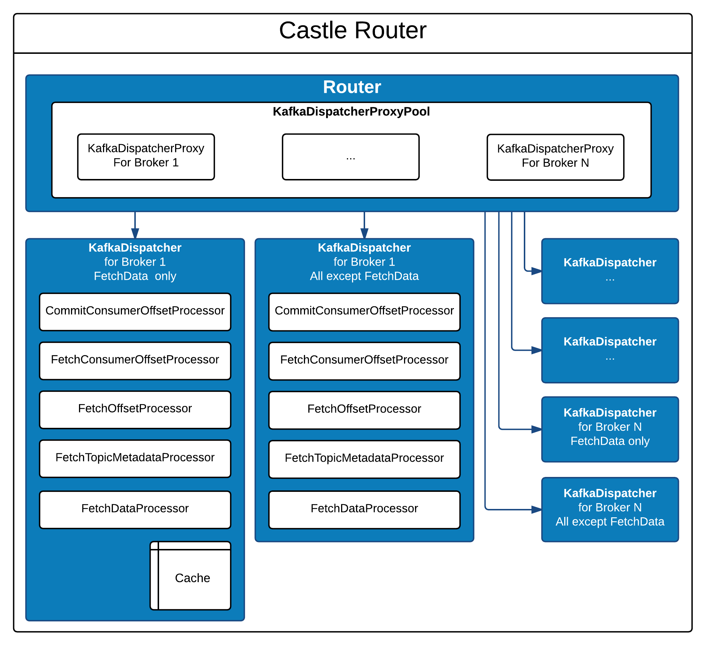

[](http://opensource.box.com/badges)

## Overview

Castle Router is an efficient implementation of querying data from Kafka built on top of the Akka framework and the 0.8.1 SimpleConsumer interface and is intended for asynchronous use by Akka actors. Castle Router supports the following five operations:

1. Committing consumer offset information
1. Fetching consumer offset information
1. Fetching offset information about a particular topic and partition
1. Fetching topic metadata which contains leader information (ISR currently not supported due to [KAFKA-1367](https://issues.apache.org/jira/browse/KAFKA-1367))
1. Fetching messages from a particular offset for a topic and partition

Castle Router attempts to batch as many operations as possible into a single request to Kafka and maintains a local cache of fetched messages to minimize network use. It does not cache the result of any other operations except for fetch message. It properly handles the following scenarios:
* Broker failures
* Leader changes
* Out of range offset requests
* Requests for unknown topics or partitions
* Corrupt messages
* Request timeouts

## How To Use Castle Router
The basic flow of using the Router by an Akka actor is:

1. Create a request message that the Router (please see below for all the types of request messages the Router can understand)
1. Send the request to the router
1. Handle the Router response which is sent to the originating actor as a message

One big caveat here is that there is no guarantee that the Router will actually respond back with a message.  There are three general approaches to handle this:

1. Use the Akka ask pattern with expiration and handle some of the failure/timeout messages the Router can send back.  There are some performance implications with doing this as well as a few other nuances around using Futures inside an actor which can be found in the Akka ask pattern documentation.
1. In addition to sending the request to the Router also schedule a "time out" message back to the actor. Then keep track of the outstanding request so it can be marked as no longer outstanding so that the "time out" message back to the actor can make a decision on whether it should retry sending the outstanding request.  There are a bunch of tricky edge cases and other nuances that must be handled in this approach.
1. Mix in the RouterRequestManager trait, which does the second option for you in a standardized way by exposing two methods: *sendRequestToRouter()* and *checkResult()*.  These two methods must be used in conjunction with each other to do the proper book keeping.  This is illustrated in the example below.  Another benefit of using RouterRequestManager is that you will automatically get all future enhancements, bug fixes, and handling of API evolution as most of the work is abstracted away.

```scala
class ExampleActor(val router: RouterRef) extends actor with Logging with RouterRequestManager {

  val topicAndPartition = TopicAndPartition("MyTopic", 3)
  val offset = 235283

  override def preStart() = {
    // sendRequestToRouter is provided to us by RouterRequestManager, 
    // which will manage the lifecycle of the request for us
    sendRequestToRouter(FetchData(topicAndPartition, offset))
  }

  override def receive: Receive = {
    case result: FetchData.Result => handleFetchDataResult(result)
  }

  def handleFetchDataResult(result: FetchData.Result): Unit = {
    // checkResult is provided to us by RouterRequestManager, we need to call
    // it here to make sure it is able to manage the lifecycle of the request for us
    checkResult(result) {
      case success: FetchData.Success =>
        // Handle success, do whatever you need to do with the actual messages
        // success.batch is guaranteed to have at least 1 message in it
      case noMessages: FetchData.NoMessages =>
        // Handle no messages, perhaps backoff for some time here to 
        // allow the topic to fill up with some messages
      case FetchData.UnknownTopicOrPartition(failedTopicAndPartition, failedOffset) =>
        // Handle unknown topic and partition, this might be a fatal exception if 
        // you really expec this topic to exist, or perhaps you can back off and try 
        // getting again later if it might get created later
      case FetchData.OffsetOutOfRange(_, offset) =>
        // Handle offset out of range, for example, query for the latest or earliest offset
        // and then issue the FetchData request again with the latest/earliest offset
      case FetchData.CorruptMessage(_, offset, nextOffset) =>
        // Handle corrupt messages, for example, log the fact that this message is corrupt and skip it
    }
  }
}

// The clientId uniquely identifies our application
val clientId = ClientId("ClientIdUniqueToApplication")
val boxSimpleConsumerFactory = new CastleSimpleConsumerFactory(clientId)

// The default logger is a no-op, you need to give your own implementation
// if you'd like to do something useful with the metrics that are being reported.
val kafkaDispatcherActorFactory = new KafkaDispatcherFactory(boxSimpleConsumerFactory, MetricsLogger.defaultLogger)

val cacheSize = 1024 * 1024 * 1024 * 4 // 4 GB
val consumerPoolFactory = new KafkaDispatcherProxyPoolFactory(kafkaDispatcherActorFactory, cacheSize, MetricsLogger.defaultLogger)

// The id for the brokers here does not matter
val brokers = Set(Broker(0, "kafka-broker1000.prod.xyz.com", 9092),
                  Broker(0, "kafka-broker1001.prod.xyz.com", 9092),
                  Broker(0, "kafka-broker1002.prod.xyz.com", 9092))

val routerFactory = new RouterFactory(consumerPoolFactory, brokers, MetricsLogger.defaultLogger)

val system = ActorSystem("my_system")

val routerRef = RouterRef(system.actorOf(routerFactory.props()))
val myActor = system.actorOf(Props(new ExampleActor(routerRef)))


```

### Supported Router request messages
All of these case classes are in the com.box.castle.router.messages name space:

#### FetchData(topicAndPartition, offset)
Send this message to the Router to fetch data from Kafka for the given (topic, partition) and offset. The sender will most likely, but is not guaranteed to, 
get one of the following *FetchData.Response* messages sent back to it:

1. *FetchData.Success* - contains a CastleMessageBatch that has AT LEAST one message
1. *FetchData.OffsetOutOfRange* - the requested offset is out of range
1. *FetchData.NoMessages* - there are no messages at the given offset, this happens if the offset was within range, but there were simply no messages written there yet
1. *FetchData.UnknownTopicOrPartition* - no such topic or partition exists
1. *FetchData.TimedOut* - the request timed out while being sent to Kafka

#### FetchOffset(offsetType, topicAndPartition)
Send this message to the Router to get the latest/earliest offset for the given topic and partition from Kafka. The sender will most likely, but is not guaranteed to, 
get one of the following *FetchOffset.Response* messages sent back to it:

1. *FetchOffset.Success* - will contain the offset
1. *FetchOffset.UnknownTopicOrPartition* - the specified topic or partition does not exist in Kafka
1. *FetchOffset.TimedOut* - the request timed out while being sent to Kafka

#### FetchConsumerOffset(consumerId, topicAndPartition)
Send this message to the Router to fetch an offset for a given consumer id and (topic, partition). The sender will most likely, but is not guaranteed to, 
get one of the following *FetchConsumerOffset.Response* messages sent back to it:

1. *FetchConsumerOffset.Success* - will contain the offset associated with the consumer id
1. *FetchConsumerOffset.NotFound* - no offset was found for the givent (topic, partition) and consumer id
1. *FetchConsumerOffset.TimedOut* - the request timed out while being sent to Kafka

#### CommitConsumerOffset(consumerId, topicAndPartition, offset)
Send this message to the Router to commit an offset for a given consumer id. The sender will most likely, but is not guaranteed to, 
get one of the following *CommitConsumerOffset.Response* messages sent back to it:

1. *CommitConsumerOffset.Success* - indicates that this offset has been durably committed
1. *CommitConsumerOffset.UnknownTopicOrPartition* - the specified topic or partition does not exist in Kafka
1. *CommitConsumerOffset.Superseded* - there was another offset already committed that is later than the given offset
1. *CommitConsumerOffset.TimedOut* - the request timed out while being sent to Kafka

#### FetchTopicMetadata(requestId)
Send this message to Router to fetch metadata for all topics. The sender will most likely, but is not guaranteed to, 
get one of the following *FetchTopicMetadata.Response* messages sent back to it:

1. *FetchTopicMetadata.Success* - contains the topic metadata for all topics in Kafka
1. *FetchTopicMetadata.TimedOut* - the request timed out while being sent to Kafka


## Configuration
The following is a list of configuration items that Castle Router needs to operate properly:

### Required
**Known brokers** – this is a list of known brokers that Castle Router can use to bootstrap the connection to the Kafka cluster

**Client Id** - The client id is a user-specified string sent in each request to help trace calls. It should logically identify the application making the request. (Source: http://kafka.apache.org/documentation.html)

**Cache Size** – this is the amount of memory in bytes the Router will use for its cache.  The router caches messages it fetches from Kafka in order to avoid network calls if there are multiple actors fetching data from the same topic and partition.


### Optional
**Broker Timeout** (Default: 60 seconds) - the amount of time a Kafka Broker has to respond before we consider the request to have timed out

**Buffer Size** (Default: 1,048,576 bytes) - the maximum number of bytes that will be requested from Kafka when fetching messages, **WARNING** this number **MUST** be higher than the number specified in the *message.max.bytes* setting of Kafka's *server.properties* or topic specific configuration overrides.  This buffer size has an impact on total network throughput and you might need to tweak it for your specific configuraiton.


## Architecture



### Overview of the layout
The router consists of a single root actor called the **Router**. The Router contains a single KafkaDispatcherProxyPool. This pool is a map between Brokers and KafkaDispatcherProxy objects.

Each KafkaDispatcherProxy contains two references to two different **KafkaDispatcher** actors, as a result the Router is the direct parent of all KafkaDispatcher actors and there are always twice as many KafkaDispatcher actors as there are Brokers in Kafka.

Each KafkaDispatcher contains a single CastleSimpleConsumer and five QueueProcessors:

1. CommitConsumerOffsetProcessor
1. FetchConsumerOffsetProcessor
1. FetchOffsetProcessor
1. FetchTopicMetadataProcessor
1. FetchDataProcessor


### Router
The Router is the public entry point for interacting with Kafka. Akka actors may send messages to this actor to initiate an asynchronous Kafka operation. When the operation completes, the requesting actor will be sent an Akka message containing the response of the operation. The Router does not provide any kind of synchronous API. The Router’s public API consists of messages that are always a subtype _RouterMessage_ and map to the five operations listed in the overview. An instance of _RouterResult_ will be sent back to the requesting actor when the operation completes, but there is no guarantee of this. Please see the how to use Castle Router section for details on dealing with this issue.

When the Router receives a _RouterMessage_, it uses the KafkaDispatcherProxyPool to find out which Broker can service the request. It then sends an Akka message to the KafkaDispatcherProxy associated with this Broker. It is also responsible for keeping an up to date mapping between topics and partitions and the current leaders for those topics and partitions.


### KafkaDispatcherProxyPool
There is one instance of the pool in the Router, it keeps an internal mapping of Brokers to KafkaDispatcherProxy as well as a mapping of TopicAndPartition to the current leader responsible for that partition. There is always one instance of KafkaDispatcherProxy for each Broker that exists in Kafka.


### KafkaDispatcherProxy
This is NOT an actor, it is a simple object that is a very thin wrapper around two references to actual KafkaDispatcher actors. The primary job of the proxy is to route the fetch message operation to one KafkaDispatcher actor and the other four operations to the other KafkaDispatcher actor. The purpose of doing this is to always keep the fetch message channel fully saturated by not interrupting it with various small operations for offset management and metadata requests.


### KafkaDispatcher
This actor is responsible for issuing requests to the Broker with which it is associated. Only the Router sends messages to KafkaDispatcher, however the KafkaDispatcher sends messages back to the original issuer of an operation. The dispatcher uses a set of QueueProcessors to accomplish its work. It round robins through the processors to ensure that all operations are satisfied and do not get starved. The KafkaDispatcher itself is a FSM that can be in either the “free” state or the “busy” state. The following is the general logic it uses to process the operation messages it receives from the Router:


	In [FREE] state:
		Receive operation message
		Find associated QueueProcessor for the operation
		If operation can be satisfied from cache:
			Send RouterResult message back to requester immediately
		Else
			Switch to [BUSY] state
			Tell QueueProcessor to perform the operation against Kafka

	In [BUSY] state:
		Receive Akka message
		If Akka message is a Kafka operation from a requester
			Find associated QueueProcessor for the operation
			If operation can be satisfied from cache:
				Send RouterResult message back to requester immediately
			Else
				Add operation to the queue of the QueueProcessor

		If Akka message is a Kafka response
			Tell the associated QueueProcessor to process the response
			Check each QueueProcessor to see if it has any queued messages in a round robin fashion, starting with the NEXT processor to avoid starvation
			If it finds a processor with pending messages
				Tell that processor to perform the operation against Kafka
			Else
				Switch to [FREE] state


The actor also handles the case where the Broker it communicates with is no longer the leader for the topic and partition it is told to process, or if its Broker is unreachable.


### QueueProcessor

There is a single processor responsible for each of the operations that can be issued to Kafka. The processor will queue operations if there is an already outstanding request to Kafka, it will also batch the operations in the most efficient manner possible for that operation type. When processing a response from Kafka, the queue processor will try to satisfy any outstanding requests that are in the queue with the current response if possible. FetchDataProcessor is the only one that will cache results in a local cache.


## Support

Need to contact us directly? Email oss@box.com and be sure to include the name of this project in the subject.

## Copyright and License

Copyright 2015 Box, Inc. All rights reserved.

Licensed under the Apache License, Version 2.0 (the "License");
you may not use this file except in compliance with the License.
You may obtain a copy of the License at

   http://www.apache.org/licenses/LICENSE-2.0

Unless required by applicable law or agreed to in writing, software
distributed under the License is distributed on an "AS IS" BASIS,
WITHOUT WARRANTIES OR CONDITIONS OF ANY KIND, either express or implied.
See the License for the specific language governing permissions and
limitations under the License.
